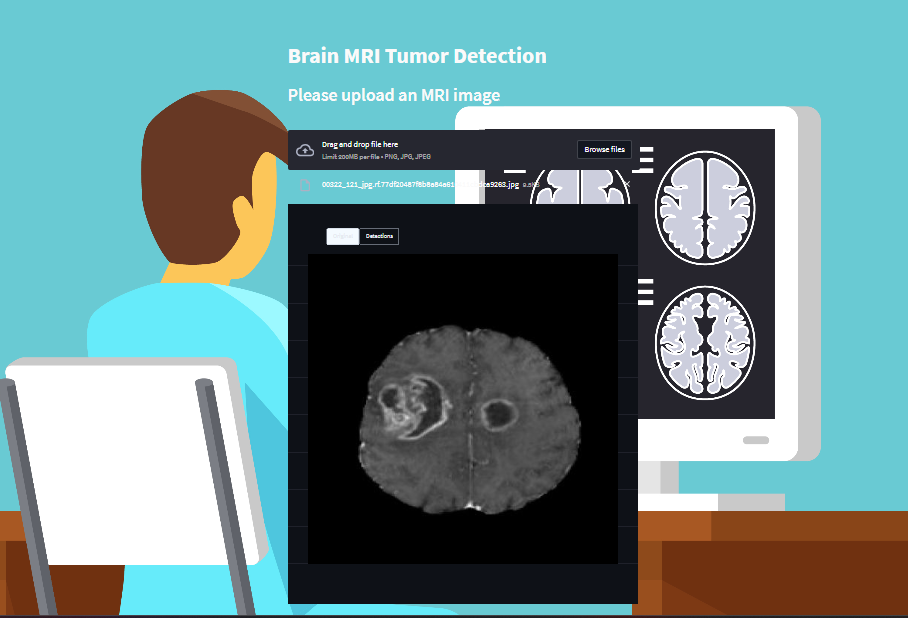
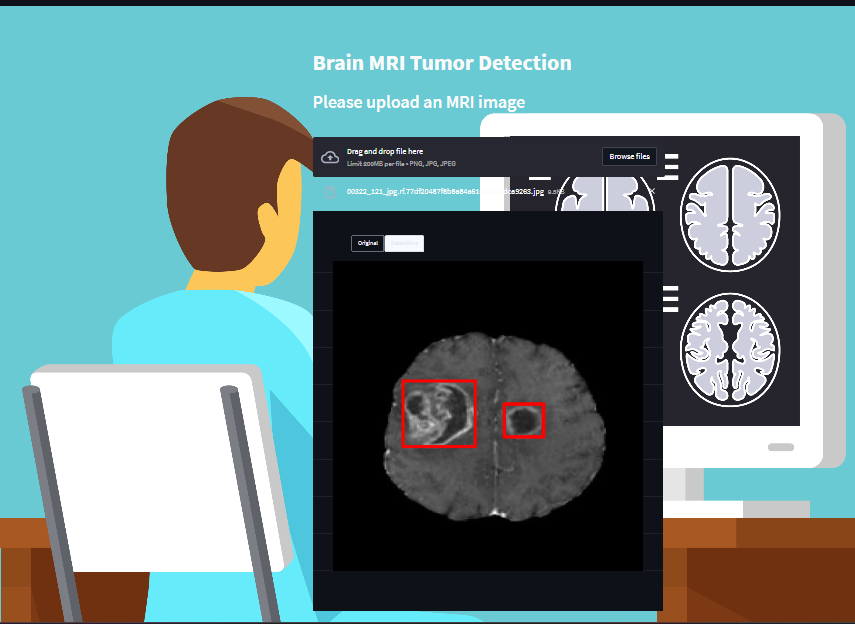

# 🧠 Brain MRI Tumor Detection - Application

This repository contains the **main application** for detecting tumors in brain MRI images using a trained Detectron2 model.  
It provides an easy-to-use interface for running inference on new MRI scans.

---

##  Running the App (Google Colab)

To run this project on **Google Colab**:

1. Mount Google Drive and install dependencies:
```python
from google.colab import drive
drive.mount('/content/gdrive')

!pip install -r requirements.txt

%cd /content/drive/MyDrive/Brain_MRI_Tumor_Detection/
```
Use ngrok or localtunnel to get a public URL and access the app in your browser.
```python
!pip install streamlit pyngrok

from pyngrok import ngrok
!ngrok authtoken [your authtoken]
```
2.Launch the app (Streamlit):
```python
from pyngrok import ngrok
public_url = ngrok.connect(8501)
print("app link", public_url)
```
---

## Model Used

The model used in this project was trained in my repository:
🔗 Model_Brain_MRI_Tumor_Detection(https://github.com/danyIkram/Model_Brain_MRI_Tumor_Detection)

---

## Example Results

| Input MRI Image | Detection Output |
|-----------------|----------------|
|  |  |

---
Notes

The model.pth file is not committed to GitHub because of its large size.

To reproduce Train your own model using (https://github.com/danyIkram/Model_Brain_MRI_Tumor_Detection)
